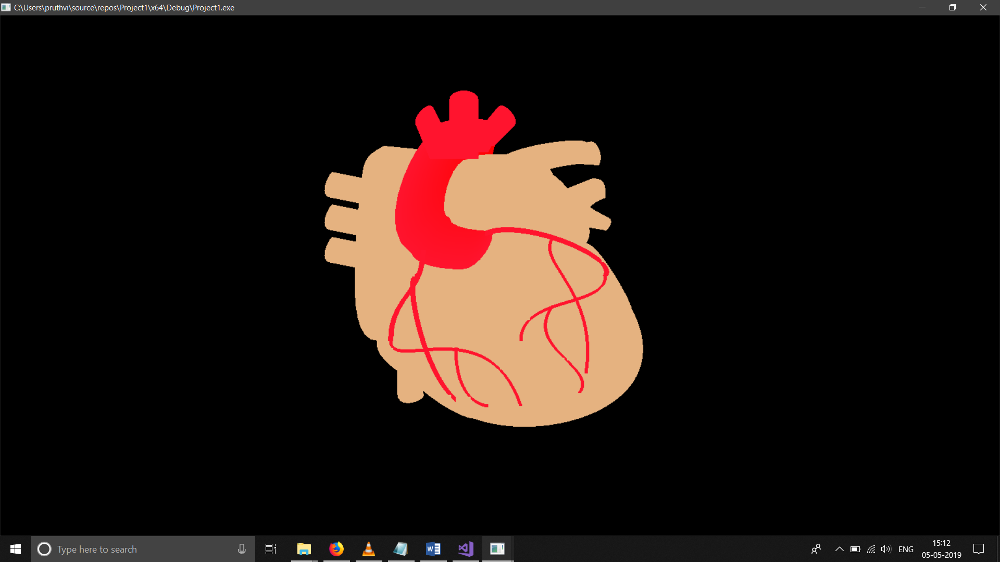

# angiogram-angioplasty
This is a basic simulation of Angiogram and Angioplasty.
## Angiogram
Angiography is an imaging test that uses X-rays to view your body’s blood vessels. The X-rays provided by an angiography are called angiograms. This test is used to study narrow, blocked, enlarged, or malformed arteries or veins in many parts of your body, including your brain, heart, abdomen, and legs
## Angioplasty
Angioplasty, also called as balloon angioplasty is an endovascular procedure to widen narrowed or obstructed arteries or veins. A deflated balloon is passed over a gauge-wire into narrowed vessel and then inflated to some extent. The baloon forces the vessel to extend. A stent is then inserted to ensure the vessel is open.

This is a lateral view of heart, with just aorta and arteries and ventricles in picture.

A tube is passed along the groin or any other vein, to reach heart. Then a greyish dye is injected into it. Therefore allowing any blockage to be seen through X-ray easily. 

An image of one vessel with blood cells flowing through.

Once a block found, angioplasty is performed.

Later a stent/mesh is attached to keep the vessel wide.
